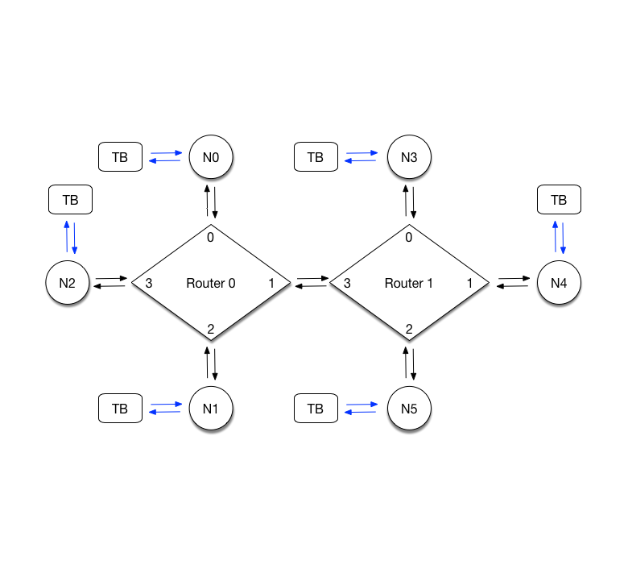
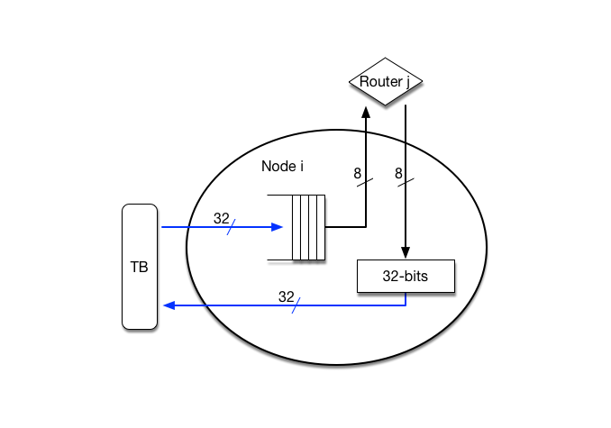
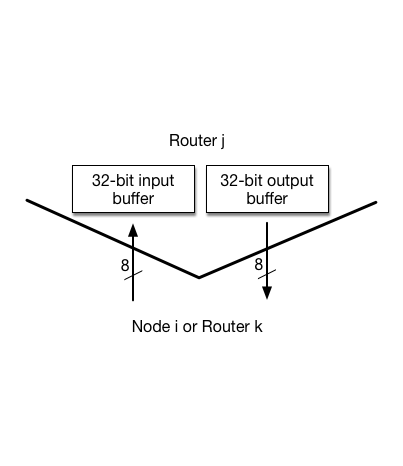
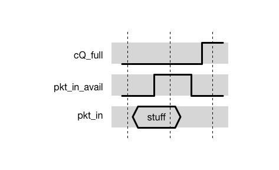
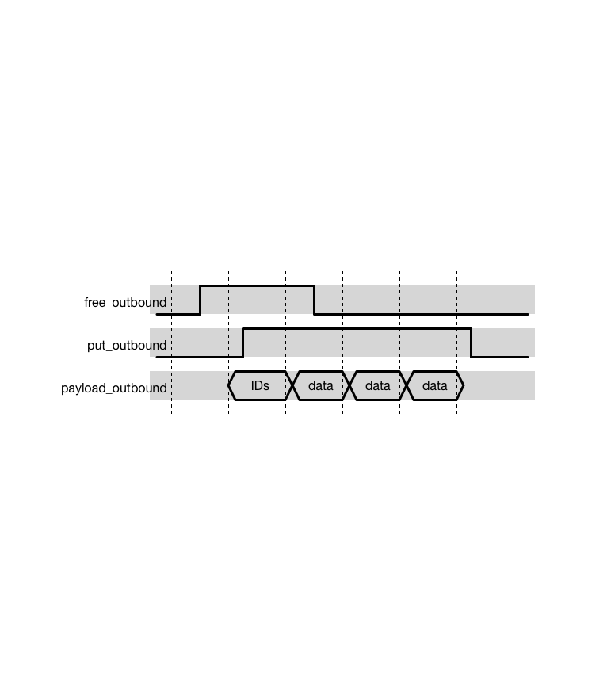
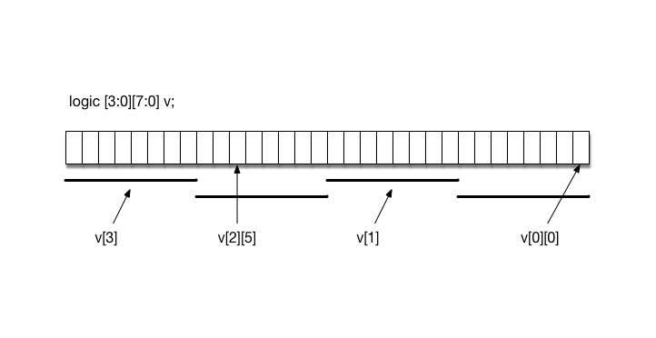

# Network on a Chip Project

18-341: Fall Semester of 2024

## Objective and Overview

The purpose of this project is to learn to work with multiple, coordinated
hardware threads.  You will use only the VCS simulator for this project;
no FPGA board.

This is an **individual** project.

## Schedule and Scoring

Project value | 100 points
--- | ---
Project start | 6 Feb 2024
Part 1 due | 16 Feb 2024 at 3:30pm
Project due | 27 Feb 2024 at 3:30pm
Drop dead date | 28 Feb 2024 at 3:30pm

Remember!  You must have uploaded something by the drop-dead date!  *You must
attempt every project*.

## A Note about Collaboration

Project 3 is to be accomplished individually.  All work must be your own.

Hints from others can be of great help, both to the hinter and the hintee.
Thus, discussions and hints about the assignment are encouraged.  However, the
project must be coded and written up individually (you may not show, nor view,
any source code from other students).  We may use automated tools to detect
copying.

Use Piazza to ask questions or come visit us during office hours (or email for
an appointment at another time).  We want to see you succeed, but you have to
ask for help.

## NOC Overview

In this project you will build the components required for a very simple
network-on-chip (NOC).  Networks on chips are used for a communication system
among lots of different components like processor cores, memories, or special IP
blocks.  NOCs attempt to be more efficient communication mechanisms than a bus,
especially in situations where lots of messages are being sent in parallel.
Each component contains logic that sends and receives messages to/from other
components.  In a NOC system, the components are each connected to a node.  The
way to communicate between components is to send a packet of information first
to its node and then through a series of interconnected routers, and then
finally to the destination node where another component is attached.  In this
project you will be designing logic for a node and router. The actual components
will be testbenches sending messages into the network and also receiving
messages from the network.

For this project, the topology is fairly simple.  Two routers, numbered 0 and 1,
connect at four numbered ports, as shown by the small numbers (0-3) in the
corners.  Each port can be connected either to another router or to a node (the
interfaces are the same).  In our case, six nodes (N0-N5) are connected to the
routers and the routers are connected together.  If N0 was going to send a
message to N1, Router 0 would just copy it from N0’s input (router port 0) to
N1’s output buffer (router port 2).  If N0’s message was to be sent to N4, then
Router 0 would copy it to port 1 which is connected to Router 1’s port 3. Then
Router 1 would copy it to Router 1’s output buffer which is connected to node
N4.  The configuration and numbering is static; it is defined in the top module
by instantiation.  There is no notion of generalizing this to a larger
configuration.

There are two modules to design: a **Node** and a **Router**.  The two routers
and six nodes are instantiations of these.  We will provide the testbenches
(though you will probably want to write your own for some developmental
testing).



The arrows indicate the possible data transfer directions; each arrow represents
a separate transfer with separate handshake protocols. The blue arrows are
between a testbench (**RouterTB**) and a Node, and the black arrows are between
a Router and a Node, or between two Routers. Both are discussed below.

## Project Overview

There are two parts to the assignment with due dates as shown above.

* In part 1, you will design and write the SV code for a Node. We will
  provide a testbench to mimic a component sending messages into the network
  through the node, and we will provide a testbench to mimic a Router sending
  message out to the node from the network.  **Beware:** The Node testbench is
  not comprehensive.  Just because your code passes these tests doesn't mean it
  is a perfectly designed and perfectly implemented Node.

* In part 2, you will design and write the SV code for the Router and
  implement the whole system shown above. We will provide testbenches that
  connect to the nodes.

The method in our madness is to first get Nodes that work correctly (i.e. follow
the protocols) with the testbench and Router interfaces.  Then focus on
designing the Router; it has lots of design choices.

## Packets and Protocols

The packets of information in our network are 32-bits in size with the
following specification (in **RouterPkg.pkg**):

```systemverilog
typedef struct packed {
  logic [3:0] src;   // The node it's coming from
  logic [3:0] dest;  // The node it's finally going to
  logic [23:0] data; // The info being sent
} pkt_t;
```

The TB to node communication (i.e. the blue arrows) is done *32-bits per clock
cycle*, while all other communication (i.e. the black arrows) is *8-bits per
clock cycle*.

The TB will send a packet to a node (in this case, **src**) as a single 32-bit
word (see diagram below).  These packets will be buffered in a hardware FIFO
queue as shown in the diagram.  The node will then send it into the network (to
its attached router) one byte at a time, sending the `{src, dest}` byte first
and then starting with bits `[23:16]` of `data[]`.  Note that the `src` is the
node it is being sent from (i.e. the node where the TB originally injected the
packet); the `dest` is the node that will eventually receive it (nodes 0-5 in
the above diagram).



The router will reassemble the 32-bit word and put it in an input buffer (of
type `pkt_t`) as shown in this more detailed diagram of a router port.  Once the
router receives it all, it will send it as one 32-bit register transfer to the
output port of the router that is connected to `dest` (let's assume for the
moment that both source and destination port are connected to the same router).
The output port of the router will then send it byte-by-byte to the destination
node.  When that destination node receives the four bytes, it will put it back
into a single 32-bit word and send it to the TB.  Thus, on the black arrow
transfer lines, the 32-bit packet is broken down into 4 bytes for transfer and
the destination port reassembles the 32-bit packet.  The blue arrow transfer
lines are full-width 32-bit transfers.



The protocol between a TB and a node is shown below -- this corresponds to the
blue arrows, a 32-bit transfer.  The labeling shown (`cQ_full`, `pkt_in_avail`,
`pkt_in`) is for the TB-to-node direction only.  An asserted `cQ_full` indicates
the FIFO queue in the node is full; no data can be sent to the node from the TB.



If the FIFO queue in the node is not full (`cQ_full` is not asserted), then the
TB may put a 32-bit packet on the input (`pkt_in`) and assert `pkt_in_avail` for
one clock period.  The node will store that value into the queue.  If (at any
time) the queue is full, then the node should assert `cQ_full` so the TB will not
try to send a packet.

For the node to testbench direction, there is no FIFO queue in the node.  The
testbench will always be ready to receive its 32-bit transfer.  The signaling
convention will mirror that of the bottom two lines in the above diagram.  The
node will only assert `pkt_out_avail` if all 32 bits are sitting on `pkt_out`.
The TB will immediately copy them (at the "next clock edge", but really 1 time
unit later) into its internal data structures.

In general, the node must be ready to receive packets from the TB continuously
until the queue fills up; it could receive them as fast as one per clock tick.
Even though there is space in the queue (`cQ_full` not asserted) the TB might
not send anything immediately.



The protocol between a node and a router, or between two routers, is
shown above -- this is an 8-bit transfer which corresponds to the black
arrows.  The router will assert `free_outbound` to indicate that it is
free to receive the outbound data.  The `put_outbound` signal from the
node indicates that the first (most-significant) of the 8-bit bytes is
on the `payload_outbound` lines, and that the other three bytes will be
available on the following clock ticks.  On the clock following
`put_outbound`’s assertion, `free_outbound` will become not asserted as
shown in the diagram. Between `free_outbound` and `put_outbound` there
could be many clock cycles because the node might not have any packets to
send.  There could also be zero clock cycles between the two signals, if
the node has a packet ready to send.

The same protocol with different names is used for the other direction.

Note that the directions “in” and “out” are with respect to the node.

## Node Interface

The node will contain the following interface.  (Notice we’re not using the
SystemVerilog keyword **interface** -- that will come later in the class.)

```systemverilog
module Node #(parameter NODEID = 0) (
  input logic clock, reset_n,

  //Interface to testbench: the blue arrows
  input  pkt_t pkt_in,        // Data packet from the TB
  input  logic pkt_in_avail,  // The packet from TB is available
  output logic cQ_full,       // The queue is full

  output pkt_t pkt_out,       // Outbound packet from node to TB
  output logic pkt_out_avail, // The outbound packet is available

  //Interface with the router: black arrows
  input  logic       free_outbound,    // Router is free
  output logic       put_outbound,     // Node is transferring to router
  output logic [7:0] payload_outbound, // Data sent from node to router

  output logic       free_inbound,     // Node is free
  input  logic       put_inbound,      // Router is transferring to node
  input  logic [7:0] payload_inbound); // Data sent from router to node

endmodule : Node
```

The testbench will provide packets (32 bits) to the node by asserting
the `pkt_in_avail` signal as described in the previous section.

## FIFO Queue in the Node

The FIFO that you will code will have a simple interface of (`clock`, `reset_n`,
`data_in`, `we`, `re`, `full`, `empty`, `data_out`).  It should be a module that
is instantiated in your node module.  The queue is to have a depth of **4**
packets and then there can be a separate, dedicated register that holds the
packet as it is being chopped up into four chunks and sent.  Thus there is a
**full capacity of 5 packets in the node** headed toward the router.  A more
detailed explanation on the functionality of your FIFO is described in
**Node.sv**.

```systemverilog
module FIFO #(parameter WIDTH=32) (
  input logic clock, reset_n,

  input logic [WIDTH-1:0] data_in,
  input logic we, re,

  output logic [WIDTH-1:0] data_out,
  output logic full, empty);

endmodule : FIFO
```

## Router

The Router you are designing will use the following module header.

```systemverilog
module Router #(parameter ROUTERID = 0) (
  input  logic            clock, reset_n,

  input  logic [3:0]      free_outbound,
  output logic [3:0]      put_outbound,
  output logic [3:0][7:0] payload_outbound,

  output logic [3:0]      free_inbound,
  input  logic [3:0]      put_inbound,
  input  logic [3:0][7:0] payload_inbound);

endmodule : Router
```

The inbound and outbound signals are the same as they were in the node, only in
this case there are four sets of them.  The way you should think of this is that
there are four separate ports (0-3) that each have a set of inbound signals and
a set of outbound signals.  For example, to access the 8-bit inbound payload
signal for port 2, you would say `payload_inbound[2]`.  This array notation is
synthesizable since all of the bits are packed.  See “Some SV things” below for
more discussion.

All data transfers within the router, e.g., from a router input to a router
output buffer, are 32-bit transfers.  These transfers will happen in one clock
tick.  They will happen when there is a router output port that is empty and
there is a router input port with a packet to go to that output port.

Of course it is possible that more than one router input port wants to send its
packet to the same output port.  No can do!  You must select one at a time to
transfer.  See notes about fairness below.

Things to consider:

* Take into account that it is possible for a packet to arrive on all four
  ports in the same clock cycle.  The job of the router is then to get those
  packets to the appropriate output port as soon as possible.

* At first, you might consider getting one transfer-per-clock working.
  That means that some of the input ports will have to wait.  But that’s OK in
  the sense that if the input port isn’t ready to accept another packet from the
  node, then the node won’t send it.  And if the node doesn’t send it, its queue
  becomes full.  And if the queue becomes full, then the TB won’t send another
  packet.  Thus no packets are lost.  It just goes slower.

* Once you get one transfer-per-clock going, consider how to make your
  router do multiple transfers at a time.  e.g., 0 -> 2 and 2 -> 1.  That will
  make your system faster.

* Eventually you should implement some sort of priority logic such that
  every packet will pass through in a fair manner.  For instance, if there are
  inputs on all of a router’s nodes, it shouldn’t always handle port 0’s input
  first.  Other ports should have their turn to be first too.  There’s a good
  “round-robin” fairness scheme to handle this where the privilege to have first
  priority is passed around -- your router will need some state to handle this.

* Besides having a bunch of concurrently active FSMs working in a
  hopefully coordinated fashion, the trickiest part of this will be the routing
  logic in the router that exhibits fairness and concurrency.
  
* You are limited in the total space available for you in the router (otherwise
  you could cover up a poor design with a really long queue).  You may have 
  space for 32 packets in the router, in addition to any registers used to
  slice up and send the IN/OUT packets.

The whole idea here is to design a router that transfers all packets sent into
it: it doesn’t lose any.  Then consider making it fast.  And then make sure it’s
fair.  If our TBs send 10K packets into the system, 10K packets better come out
at the correct destination nodes!  Of course, it’s better if it’s fast and fair.
This part is a design project; there are many ways to implement this, including
internal queues in the router, etc.

## Some SV Things

OK, so what is a:

```systemverilog
input logic [3:0][7:0] payload_inbound;
```

This is a packed, multidimensional vector.  (Read about arrays, multidimensional
arrays and packed arrays in Chapter 13 of the SV book, but the following is a
concise overview.)  Consider the diagram below that declares a multidimensional
bit vector **v** with the same indices.  When declared this way, these
dimensions are packed, having the same meaning as packed when used with a
structure:  it’s all shoved together as one big-mama vector.  As we’ll see
later, it’s also synthesizable.  So, this declares a 32-bit blob-o-data with 4
sub-vectors (3 down to 0) of 8 bits each.  The last (rightmost) of the
dimensions is the one that increments fastest (that is, the diagram starts with
sub-vector 3, bits 7 down to 0, then sub-vector 2, bits 7 down to 0, … the
rightmost dimension is incrementing faster).  Note how various sub-vectors and
bits are named.



What’s this have to do with us?  In our case, (above definition) we have a
router with four 8-bit input data ports.  We can access the whole 8-bit port
(e.g., `v[1]` above), or access a bit within the port (e.g., `v[2][5]` above).
We define them this way to make it easier to connect various pieces of the
design together.  See the provided files.

Also, in your node, you need a queue that has four elements of type `pkt_t` in
it. The way to do that and make it synthesizable is:

```systemverilog
pkt_t [3:0] queue;   //a packed array of four packets
```

You could then reference elements of the queue as:

```systemverilog
queue[1].src = 2;
queue[2].dest = 3;
```

Or you could access the whole element as `queue[0]`.

## File Structure

Your NoC starting repo contains the following files:

* **Node.sv** -- A module with headers is provided in the handout folder, use
  this for your node and fifo.  The six nodes will each be an instantiation of
  this module.

* **Router.sv** -- A module with headers is provided in the handout folder, use
  this for your router.  It will be instantiated twice.

* **RouterPkg.pkg** -- This is similar to a C++ header file with a namespace...

* **Router.svh** -- Header file containing some definitions.

* **Top.sv** -- Provided in handout folder.  Don’t change it.  It needs to be
  the first file on the command line of the simulator.  It instantiates the
  nodes and routers and connects them together.  There’s some cool code in
  there; we’ll explain later.

Don’t change any of the port lists.  Don’t have any global variables (some
variable that is not in the port list – that’s bad style anyway) that need to be
set by you before running.  When we automatically demo this, there will be no
one to set that variable.

We will provide several testbenches for you; some for part 1 and others for part
2.  Use them to develop your SV code -- we’ll use them to demo and grade it.
Excuses like “but I wrote my own TB and it works perfectly on mine but not on
yours” will bring great laughter in the TA meeting (go ahead, make our day).

For part 1 checkoff:

```sh
$ make prelab
... some compilation stuff ...

$ ./simv
```

For part 2 demo:

```sh
$ make full
... some compilation stuff ...

$ ./simv +VERBOSE=1 +BASIC +ACROSS +BROADCAST +STRESS_SRC +STRESS_DEST +FAIRNESS +PERFORMANCE

-----------------------------------------------------------
 <Started> Performance Test
-----------------------------------------------------------

-----------------------------------------------------------
 <Finished> Performance Test
    Cycle count: ?????
-----------------------------------------------------------
```

## Testbench Usage

1. Compile your code using the Makefile supplied "make {full/clean}"
2. Run the testbench with one or more of the following runtime arguments

  `./simv {-gui} {+{plusargs ... }} {+vcs+finish+{d}} {+VERBOSE={1,2,3}}`

   e.g. `./simv -gui +STRESS_SRC +STRESS_DEST +PERFORMANCE +vcs+finish+10000 +VERBOSE=3`

* `+BASIC`: transfer one packet at a time between every node pair
  within the same router

* `+ACROSS`: transfer one packet at a time between every node pair
  going across the bridge

* `+BROADCAST`: test triangular concurrency between every node pair in
  the same router; for example 0->1 1->2 2->3 simultaneously

* `+STRESS_{SRC,DEST}`: TB bombards a single node (source or destination) with
  packets to stress internal queues

* `+FAIRNESS`: TB checks for transaction fairness across the bridge
  by sending three packets simultaneously and checking that one node source is
  not always routed first. There is a 10% tolerance, but all three sources
  should arrive first with an approximately even distribution.

* `+PERFORMANCE`: deterministically measures router performance under
  real-world conditions

### You don’t want to tick off the TA!

When we demo your network on chip with you sitting there watching, we will
execute a command such as those listed just above.  You don’t want to tick off
the TAs and make them have to change their command file just for you, so be sure
to follow all the above naming conventions!

## How To Turn In Your Solution

You are to build the Network on Chip specified above using the FSM-D level of
modeling you learned in 18-240.  All of your components (e.g., Node, FIFO and
Router) should be written in clean synthesizable SystemVerilog code.  We will
use the VCS simulator to grade your design.  Use it to develop your design too.
(There are some differences here and there with other simulators -- don’t get
caught on one of those.)

This semester we will be using
[Github Classroom](https://classroom.github.com/classrooms/42654531-18-341-fall-2018)
to hand-out as well as hand-in project code. Make sure to commit regularly and
provide informative messages, as this will help TAs immensely to provide
feedback.

### Part 1

Develop your node solution in a file named **Node.sv**.  Tag it with
"final_part1" and ensure you push your repo to GitHub.

There will be no separate demo for Part 1.  You will demonstrate it to us during
the Part 2 demo.

### Part 2

Use your **Node.sv** along with your **Router.sv** to
demonstrate the whole NOC system.  Make sure it works properly with all of the
provided testbenches.

In the **doc/** directory of your repo, you should include any of your design
documentation.  I will spare you the agony of a formal report, but you must have
*complete* state transition diagrams for all FSMs and component-level schematics
for your datapaths.  The TAs will be examining these during the demo and will
expect your answers to match the diagrams (which should match your code).

Again, we will simulate your code with our grading testbench and use the output
to give you some of the grade.

We will also look through your code to grade it for style and conformance to the
class coding standards.  Even though we won't be putting this project on the
FPGA board, your code should be synthesizable.

You will then have a demo, scheduled soon after the deadline, during which you
can impress us with the brilliance of your design.

## Git Reminders

When you have finished part 2 you should tag the release for
submission, push your repo to GitHub and submit it to Gradescope.

Here's a reminder of the steps you should follow:

1. Do Git stuff:
  ```sh
$ git branch gradescope_final
$ git checkout gradescope_final
$ git add --all
$ git commit -m "My final submission.  Wow, that was fun!"
$ git push -u origin gradescope_final
$ git tag -a final -m "Final submission for 18341 P3"
$ git push --tags  
  ```

2. Log onto Gradescope and select the P3: NOC assignment.

3. Select the repo you want to submit.

4. Press submit!

**If you need to alter your submission, remember to delete the tag.**

Remotely:
```sh
$ git push --delete final
```

Locally:
```sh
$ git tag -d final
```

## Late Penalty

**Define Late:**  Lateness is determined by the file dates of your repo.

**Grace Day:**  You may use your grace day to turn in the solution up to 24
hours late.  If you do not intend to use a grace day (or have already used
yours), make sure you have something in the repo (and have pushed the repo) at
the deadline to avoid getting a zero on this project.

**Drop Dead Date:**  The last time to turn in this project is listed on the
first page.  Upload what you have by that time and we’ll do a “demo” with you to
see what partial credit we can give.  Even if your code doesn’t completely
compile, execute, or solve the problem, upload what you have.  i.e., it’s time
to get some credit for what you’ve done.  More importantly: Time to move on.
